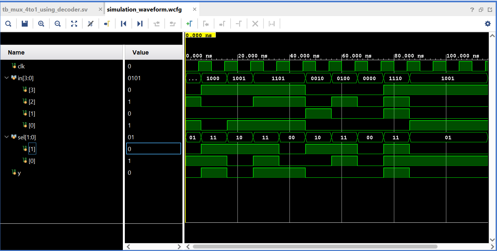

# 4x1 MUX Using Decoder – RTL Design & SystemVerilog Verification

## 📌 Project Overview
This project implements a **4x1 Multiplexer using a 2-to-4 Decoder** in SystemVerilog and verifies it using a layered, class-based verification environment.

The verification architecture follows a modular approach similar to UVM-style methodology.

---

## 🏗️ Design Architecture

### 🔹 RTL Modules
- `decoder_2to4`
- `mux_4to1_using_decoder`

The MUX output is generated by ANDing decoder outputs with input signals.

---

## 🧪 Verification Architecture

The testbench includes:

- Interface
- Transaction class
- Generator
- Driver
- Monitor
- Scoreboard
- Environment
- Event synchronization
- Mailbox-based communication

### Verification Flow:
1. Generator creates randomized transactions
2. Driver applies inputs to DUT
3. Monitor captures DUT activity
4. Scoreboard compares expected vs actual output
5. PASS/FAIL reported in simulation

---

## 🔍 Functional Validation

- Randomized testing performed for multiple transactions
- Scoreboard ensures correct output selection
- Waveform verified against expected logic behavior

---

## 📊 Simulation Result

All test cases passed successfully.

---

## 🛠 Tools Used
- Xilinx Vivado (XSim)
- SystemVerilog

---

## 🎯 Key Concepts Demonstrated

- RTL Design
- Combinational Logic
- Decoder-based MUX Implementation
- Layered Verification Architecture
- SystemVerilog OOP
- Mailbox Communication
- Event Synchronization
- Self-checking Testbench

---

## 🚀 Learning Outcome

This project strengthened understanding of:
- Frontend RTL Design
- Verification Flow
- Debugging & Simulation in Vivado
- Structured Testbench Development

---

## 👨‍💻 Author
Sohel Bagali  
Aspiring Frontend RTL & Verification Engineer
